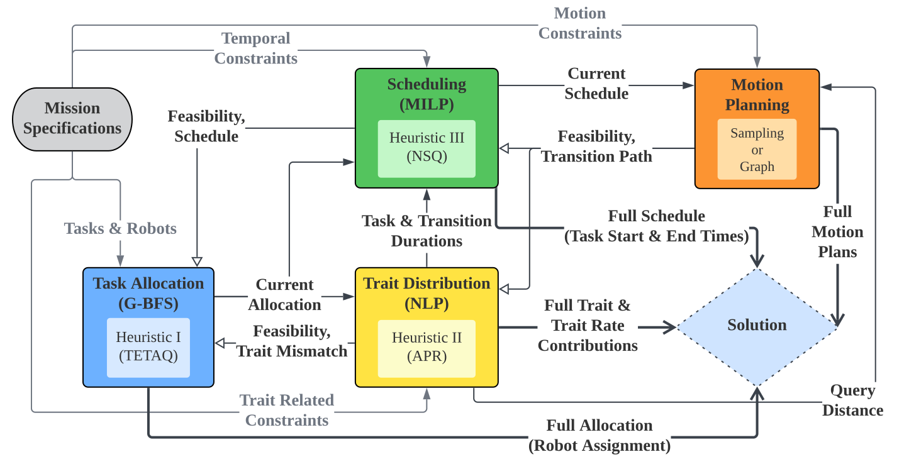

# Modeling and Optimizing the Provisioning of Exhaustible Capabilities for Simultaneous Task Allocation and Scheduling

<p align="center">
  <span style="display:inline-block; width:40%; text-align:center; vertical-align:top;">
    <br/>
    <em>A figure of motivating scenario</em>
  </span>
  <span style="display:inline-block; width:40%; text-align:center; vertical-align:top;">
    <br/>
    <em>High-level architecture of the TRAITS framework</em>
  </span>
</p>

## Description

This repository contains the various components of the 
**TRait Throughput and Allocation Informed Team Scheduling (TRAITS)** framework.

It incorporates **refactored and selectively used components** from
**Forward Chaining Partial-Order Planning (FCPOP)**,
**Incremental Task Allocation Graph Search (ITAGS)**, and
**Graphically Recursive Task Allocation, Planning, and Scheduling (GRSTAPS)**.

Specifically, we introduce a **nonlinear programming–based trait distribution module**
to handle the provisioning of **exhaustible traits** under **temporal and battery constraints**.


## Dependencies

**Note: We list all the dependencies down below to recognize the libraries that we use; however, all development should
be done in the docker container. Any issues from trying to create a local environment will not be a priority.**

### apt

- libboost-all-dev
- libeigen3-dev
- libompl-dev
- libyaml-cpp-dev

### public repositories

- [benchmark](https://github.com/google/benchmark)
- [cli11](https://github.com/CLIUtils/CLI11)
- [fmt](https://github.com/fmtlib/fmt)
- [googletest](https://github.com/google/googletest)
- [json](https://github.com/nlohmann/json)
- [magic enum](https://github.com/Neargye/magic_enum)
- [robin-hood-hashing](https://github.com/martinus/robin-hood-hashing)
- [spdlog](https://github.com/gabime/spdlog)

### other

#### Gurobi

We use [Gurobi](https://www.gurobi.com/) to solve Mixed Integer Linear Programming problems. In order to use this with
the docker, you will need to get a Web License ([click here](https://www.gurobi.com/academia/academic-program-and-licenses/)) and then put the
associated ```gurobi.lic``` file in ```docker/gurobi```. The license file is in the .gitignore and should under ___NO___
circumstance become part of the repository (simply do not change that line and this shouldn't ever be something to worry
about). You are responsible for your own gurobi license.

#### Open Motion Planning Library (OMPL)

We use [OMPL](https://ompl.kavrakilab.org/) as one of our options for solving motion planning problems.

## Table 2 benchmark

`data/problem_inputs/traits/aamas2026_table2` holds the 100 instances used to compare TRAITS
against ITAGS: `K, N in {5, 10, 15, 20, 25}` tasks and robots, four instances per cell. Both
planners read the same file.

### Running

Put your own `gurobi.lic` in `docker/gurobi`, then:

```bash
docker build -t traits -f docker/Dockerfiles/amd64/Dockerfile .
docker run --rm -it \
    -v "$PWD":/work \
    -v "$PWD/docker/gurobi/gurobi.lic":/opt/gurobi/gurobi.lic:ro \
    -w /work traits bash

# inside the container
cmake -DCMAKE_BUILD_TYPE=Debug -S . -B build
cmake --build build --target unittests --parallel
cd build/tests
./unittests --gtest_filter=TRAITS.aamas2026_table2
```

The test writes one solution per instance to `build/aamas2026_table2/` and a per-instance
`table2_traits.csv`. A full run takes a few hours; to check the setup first:

```bash
TRAITS_TABLE2_FIRST=1 TRAITS_TABLE2_LAST=4 ./unittests --gtest_filter=TRAITS.aamas2026_table2
```

### Results

| row | TRAITS | ITAGS |
|---|---|---|
| plan feasibility [%] | 100.0 | 57.9 |
| task trait insufficiency [%] | 0.0 | 11.4 |
| provisioning rate insufficiency [%] | 0.0 | 41.8 |
| under-resourced robots [%] | 0.0 | 26.6 |
| C-rating violations [%] | 0.0 | 48.7 |
| battery-capacity violations [%] | 0.0 | 28.6 |
| deadline violations [%] | 0.0 | 7.3 |

TRAITS solves all 100 instances. Score a run yourself with:

```bash
python3 python/score_table2.py aamas2026_table2                       # TRAITS
python3 python/score_table2.py <itags_output_dir> --planner itags      # ITAGS
```

Each instance is given an 800 s search budget, comfortably above the longest any of them
took in a run where all 100 solved. The NLP trait distributor has a 1 s timeout of its
own, so the search is not bit-reproducible: an instance can be reported infeasible on
one run and solved on the next. Re-run anything marginal rather than reading it as a
failure.

### Generating new instances

The numbers above come from the fixed set in `data/problem_inputs/traits/aamas2026_table2`,
which is shipped as data so that everyone scores the same 100 scenarios. To try the planner
on fresh problems instead, `python/aamas2026_table2_generator.py` samples a new set of the
same shape - four scenarios for each (tasks, robots) pair from {5, 10, 15, 20, 25}:

```bash
cd python && python3 aamas2026_table2_generator.py --out my_set --seed 1234
TRAITS_TABLE2_DIR=/problem_inputs/traits/my_set ./unittests --gtest_filter=TRAITS.aamas2026_table2
python3 python/score_table2.py my_set
```

A generated set is solvable but loosely bounded: its deadlines and current ceilings are
sampled, not fitted to a plan, so the baseline comparison in the table above will not
reproduce on it. It is a source of new problems, not a regeneration of the benchmark.

# Citations

### [Forward Chaining Hierarchical Partial-Order Planning](http://robotics.cs.rutgers.edu/wafr2020/wp-content/uploads/sites/7/2020/05/WAFR_2020_FV_43.pdf)

```
Messing, A., & Hutchinson, S. (2020, June). Forward chaining hierarchical partial-order planning. 
In International Workshop on the Algorithmic Foundations of Robotics (pp. 364-380). Springer, Cham.
```


### [Incremental Task Allocation Graph Search](https://ieeexplore.ieee.org/stamp/stamp.jsp?arnumber=9636569)

```
Neville, G., Messing, A., Ravichandar, H., Hutchinson, S., & Chernova, S. (2021, August). 
An interleaved approach to trait-based task allocation and scheduling. In 2021 IEEE/RSJ 
International Conference on Intelligent Robots and Systems (IROS) (pp. 1507-1514). IEEE.
```

### [Graphically Recursive Simultaneous Task Allocation, Planning, and Scheduling]()

```
Messing, A., Neville, G., Chernova, S., Hutchinson, S., & Ravichandar, H. (2021). 
GRSTAPS: Graphically Recursive Simultaneous Task Allocation, Planning, and Scheduling. 
The International Journal of Robotics Research.
```

### [Modeling and Optimizing the Provisioning of Exhaustible Capabilities for Simultaneous Task Allocation and Scheduling](https://doi.org/10.65109/NGQQ5993)
```
Jinwoo Park, Harish Ravichandar, and Seth Hutchinson. 2026. Modeling 
and Optimizing the Provisioning of Exhaustible Capabilities for Simultaneous 
Task Allocation and Scheduling. In Proc. of the 25th International Conference 
on Autonomous Agents and Multiagent Systems (AAMAS 2026), Paphos, Cyprus, 
May 25 – 29, 2026, IFAAMAS, 9 pages. https://doi.org/10.65109/NGQQ5993
```

# Licensing

See [LICENSE](LICENSE)

# Contributors
- Andrew Messing
- Glen Neville
- Jinwoo Park
